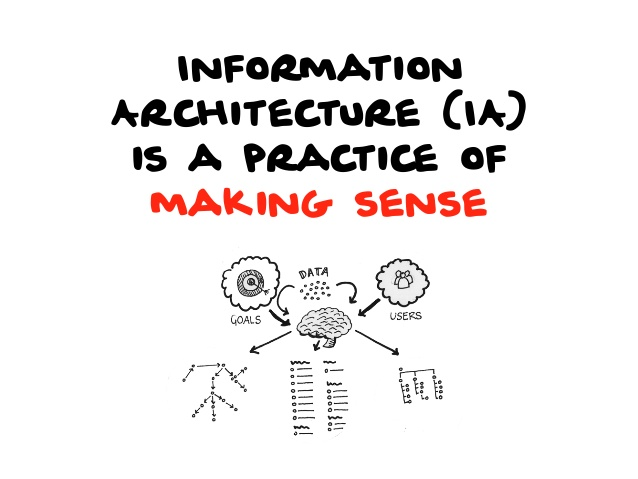

# La taxonomie

## ou l'art de raconter des salades

---

<!-- .slide: data-transition="convex" -->
## La salade de fruits
Recette + image (ex. )

Notes : explication par l'absurde de la nécéssité d'une taxonomie pour ne pas faire d'erreurs

---

<!-- .slide: data-transition="concav" -->
## La salade de fruits
Comment aurions-nous pu éviter cet écueil ?

---

<!-- .slide: data-transition="convex" -->
## La taxonomie : what the hell is it ?!
Explication de la tomate (part one)

---

<!-- .slide: data-transition="convex" -->
## La taxonomie : what the hell is it ?!
Explication de la tomate (part two)

---

<!-- .slide: data-transition="convex" -->
## L'ontologie : know what you mean when you say what you say
Explication de l'orange (part one)
- Orange (fruit) <!-- .element: class="fragment" -->
- Orange (couleur) <!-- .element: class="fragment" -->
- Orange (amplis) <!-- .element: class="fragment" --> 
- Orange (Opérateur télécom) <!-- .element: class="fragment" -->

---

<!-- .slide: data-transition="convex" -->
## L'ontologie : know what you mean when you say what you say
Explication de l'orange (part two)

---

<!-- .slide: data-transition="convex" -->
## Linked data : on s'attache !
?? (part one)

---

<!-- .slide: data-transition="convex" -->
## Linked data : on s'attache !
?? (part two)

